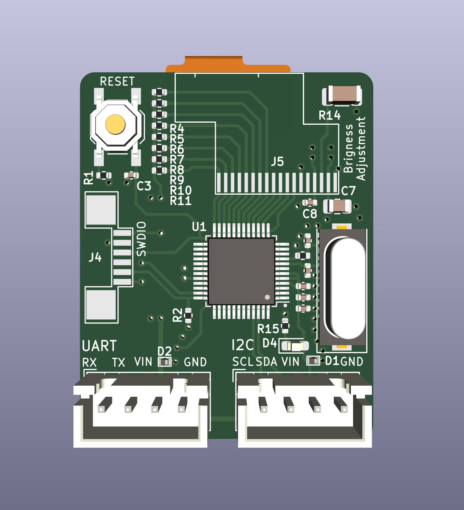
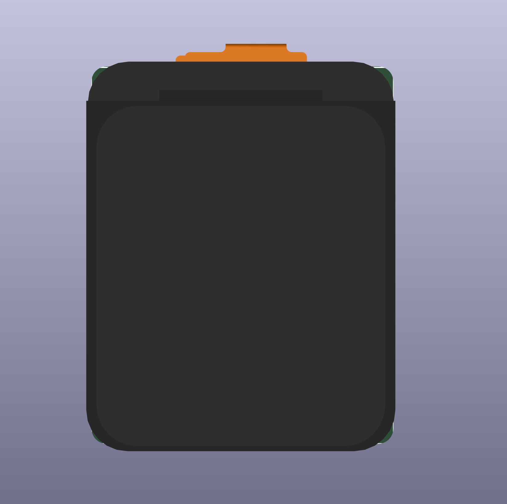

# ER-TFT1.69-1_STM32-Driver

STM32 Driver and Adapter design for the following module:

[LCD Display Panel](https://www.buydisplay.com/1-69-inch-color-280x240-round-rectangle-ips-tft-lcd-display-panel-st7789)

The driver is based on the example code, refactored to work with the Adapter. It can be used standalone or with the adapter board. For standalone usage, you can copy the following two files into your own project:

- [```Driver/Core/Inc/ST7789V.h```](Driver/Core/Inc/ST7789V.h)
- [```Driver/Core/Src/ST7789V.c```](Driver/Core/Src/ST7789V.c)

If you recreate the adapter, then you just need to load the Driver into STM32CubeIDE and program the MCU. The adapter is using a STM32G030C8TX MCU, but you can replace it with any other STM32 if you want to extend the adapter. The only requirement is that you follow the pinout and connect them the same way as in the original design.


